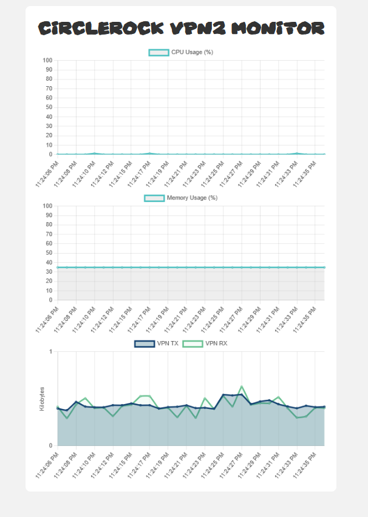

# Flask Webserver to Monitor a Wireguard VPN

---

  

---

This is a <em>highly<em> specialized systemd service packaged up into a nice little debian repository which monitors the status of my VPN servers CPU utilization, Memory usage, and VPN traffic. I may in the future add config files to create a generic system monitoring utility. As of now it serves as a local dashboard for me myself and I, and a way to teach myself `dpkg-buildpackage`

Built using `dpkg-buildpackage -b`

